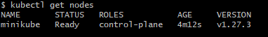
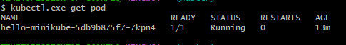

# Project-14: Kubernetes Cluster Setup through Minikube

[*Project Source*](https://medium.com/r/?url=https%3A%2F%2Fwww.udemy.com%2Fcourse%2Fdecodingdevops%2Flearn%2Flecture%2F31935208%23overview)


## Pre-requisites:
* Chocolatey
* PowerShell
* Virtual Box

## Steps!

- Clone the source code
```sh
git clone https://github.com/devopshydclub/vprofile-project.git
git pull ( To stay updated incase you have the repository already )
git checkout kubernetes-setup
ls
cd minikube/
```

- Open PowerShell as Administrator and execute below command
```sh
Set-ExecutionPolicy Bypass -Scope Process -Force; [System.Net.ServicePointManager]::SecurityProtocol = [System.Net.ServicePointManager]::SecurityProtocol -bor 3072; iex ((New-Object System.Net.WebClient).DownloadString('https://chocolatey.org/install.ps1'))
```

- After installation, close PowerShell and run again with Admin privilege
```sh
choco install minikube kubernetes-cli -y
```

- Close PowerShell and run below commands with Gitbash
```sh
minikube.exe --help
minikube start
kubectl get nodes
```




- Run few tests on Kubernetes to indicate that the deployment was successfully created
```sh
cat .kube/config
kubectl.exe get nodes
kubectl create deployment hello-minikube --image=k8s.gcr.io/echoserver:1.10
kubectl.exe get pod
```



- Expose it to created a service which we can then access `kubectl` expose deployment, deployment name - type node port on `port 8080`
```sh
kubectl expose deployment hello-minikube --type=NodePort --port=8080
```

- Change the url of the deployment by executing below command
```sh
minikube service hello-minikube --url
```


- access the application using the url


- Clean up by executing below command
```sh
kubectl.exe get svc
kubectl.exe delete svc hello-minikube
kubectl.exe delete deploy hello-minikube
minikube.exe stop
minikube delete
```


